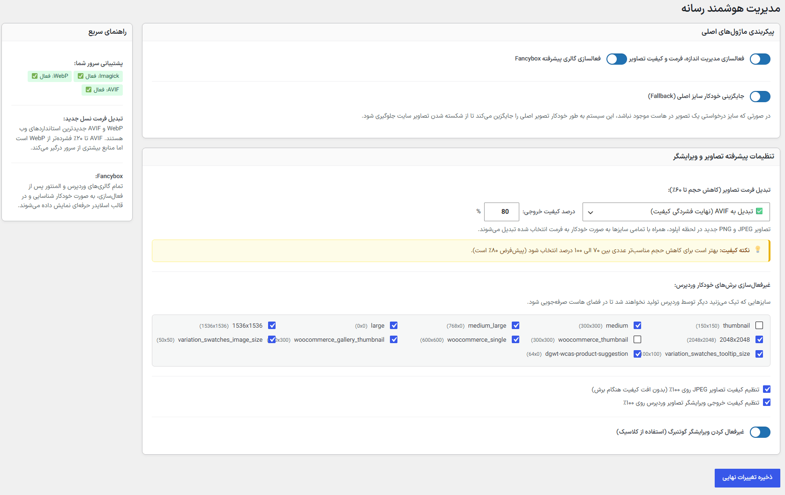

# Smart Media & Database Optimizer 🚀

افزونه **Smart Media & Database Optimizer** یک جعبه‌ابزار حرفه‌ای، سبک و شیءگرا (OOP) برای سیستم مدیریت محتوای وردپرس است. این افزونه با هدف بهینه‌سازی پیشرفته تصاویر (سئو و سرعت)، پاک‌سازی و یکپارچه‌سازی جداول دیتابیس MySQL (از جمله ووکامرس)، مدیریت فضای هاست و ارتقای تجربه کاربری (UX) طراحی شده است. تمام امکانات موردنیاز برای شتاب‌بخشی به سایت در یک پنل مینیمال و ایجکس در اختیار شماست.

---

## ✨ قابلیت‌های کلیدی و امکانات پیشرفته

* **🔄 تبدیل خودکار به WebP و AVIF:** تبدیل هوشمند و در لحظه تصاویر آپلودی (JPEG/PNG) به فرمت‌های فوق‌فشرده WebP یا AVIF جهت افزایش چشمگیر سرعت سایت و بهبود امتیاز Core Web Vitals.
* **🎛️ کنترل دقیق کیفیت (Compression Control):** امکان تعیین درصد کیفیت (۰ تا ۱۰۰) برای فرمت‌های نسل جدید و همچنین قفل کردن کیفیت JPEG و PNG روی ۱۰۰٪ برای جلوگیری از افت کیفیت هنگام برش تصاویر.
* **🧠 بررسی هوشمند سرور:** آنالیز زنده سرور جهت بررسی فعال بودن اکستنشن `Imagick` و پشتیبانی از فرمت‌های WebP/AVIF همراه با نمایش هشدارهای راهنما در پنل افزونه.
* **✂️ مدیریت ابعاد وردپرس (ISQM):** جلوگیری از ساخته شدن سایزهای اضافی و بلااستفاده توسط وردپرس و قالب برای صرفه‌جویی شدید در فضای هاست (Disk Space).
* **🗄️ پاک‌سازی جامع دیتابیس (Database Janitor):** حذف امن رونوشت‌ها (Revisions)، پیش‌نویس‌های خودکار، متادیتاهای یتیم، دیدگاه‌های اسپم/زباله‌دان، ترنزینت‌های منقضی‌شده و برچسب‌های بدون استفاده.
* **⚙️ یکپارچه‌سازی و Defragment موتور InnoDB:** اجرای دستورات `OPTIMIZE` روی جداول کلیدی وردپرس جهت آزادسازی فضای بلوک‌های هارد و نوسازی ایندکس‌ها.
* **🛒 مدیریت Action Scheduler ووکامرس:** پاک‌سازی فوری لاگ‌های تاریخ‌گذشته ووکامرس و قابلیت تنظیم دلخواه دوره نگهداری خودکار (مثلاً ۲ روز به جای ۳۰ روز پیش‌فرض).
* **📊 تحلیلگر زنده Autoload:** محاسبه آنی حجم کل رکوردهای Autoload در جدول `options` به همراه لیست ۱۰ گزینه سنگین و بحرانی.
* **🖼️ گالری پیشرفته Fancybox:** شناسایی خودکار تمامی گالری‌های وردپرس و المنتور و نمایش آن‌ها در قالب یک لایت‌باکس ریسپانسیو، مدرن و جذاب.
* **🛡️ سیستم جایگزینی هوشمند (Fallback):** جلوگیری از خطای تصاویر شکسته (404). در صورت موجود نبودن یک سایز خاص از تصویر در هاست، افزونه به طور خودکار نسخه اصلی را جایگزین می‌کند.
* **⚡ عملکرد غیرهمگام (AJAX UI):** ذخیره تنظیمات و پاک‌سازی‌های دیتابیس بدون رفرش صفحه و به همراه پاپ‌آپ‌های تأیید مدرن.

---

## 💻 ساختار کد و راهنمای توسعه‌دهندگان

این افزونه به‌طور کامل شیءگرا و با رعایت سخت‌گیرانه‌ترین استانداردهای مخزن وردپرس (WordPress.org) توسعه یافته است.

### ۱. معماری شیءگرا و Namespace
افزونه از الگوی طراحی **Singleton** بهره می‌برد و تمامی کدها در `namespace SmartMediaDatabaseOptimizer` ایزوله شده‌اند تا از هرگونه تداخل (Conflict) با سایر افزونه‌ها یا قالب‌ها جلوگیری شود.

### ۲. بهینه‌سازی دیتابیس (Autoload)
تمامی Optionهای مربوط به تنظیمات پنل با پارامتر `autoload = no` در دیتابیس ذخیره می‌شوند تا در سمت کاربر (Front-end) حافظه RAM سرور را اشغال نکنند.

### ۳. مدیریت امن فایل‌سیستم (I/O)
تمامی عملیات‌های حذف و جایگزینی فایل‌ها بدون استفاده از توابع ناامن PHP (مثل `unlink` یا `is_writable`) و کاملاً از طریق توابع بومی وردپرس (`wp_delete_file`) انجام می‌شود.

### ۴. سفارشی‌سازی Fancybox
کدهای مربوط به اجرای Fancybox از طریق ساختار `NOWDOC` در PHP تزریق می‌شوند. برای تغییر پارامترهای انیمیشن، دکمه‌ها و... کافیست متد `enqueue_frontend_assets` را در کلاس `Plugin` شخصی‌سازی کنید.

---

### 📸 پیش‌نمایش پنل مدیریت

---

## 🤝 راهنمای مشارکت (Contribution)

از مشارکت توسعه‌دهندگان خوش‌ذوق برای بهبود این پروژه متن‌باز استقبال می‌شود! مراحل مشارکت:

1. ابتدا پروژه را Fork کنید.
2. یک شاخه (Branch) جدید برای ویژگی یا رفع باگ خود بسازید:
   `git checkout -b feature/AmazingFeature`
3. تغییرات خود را Commit کنید:
   `git commit -m 'Add some AmazingFeature'`
4. به شاخه اصلی Push کنید:
   `git push origin feature/AmazingFeature`
5. یک Pull Request باز کنید تا بررسی شود.

---

## 🛠 نصب و راه‌اندازی

1. سورس افزونه را دانلود کرده و پوشه آن را در مسیر `wp-content/plugins/` آپلود کنید.
2. افزونه **Smart Media & Database Optimizer** را از بخش «افزونه‌ها» در پیشخوان وردپرس فعال کنید.
3. از منوی کناری پیشخوان به مسیر **بهینه‌ساز هوشمند** بروید و تنظیمات دلخواه را اعمال کنید.

---

## 👨‍💻 توسعه‌دهنده
طراحی و توسعه توسط **امین ارجمند**
- [وب‌سایت شخصی](https://aminarjmand.com)
- [سایت سازنده](https://mohandeseit.com)

## 📄 لایسنس
این پروژه تحت لایسنس **GPLv2 or later** (استاندارد رسمی وردپرس) منتشر شده است و استفاده، تغییر و بازنشر آن برای همگان آزاد است.